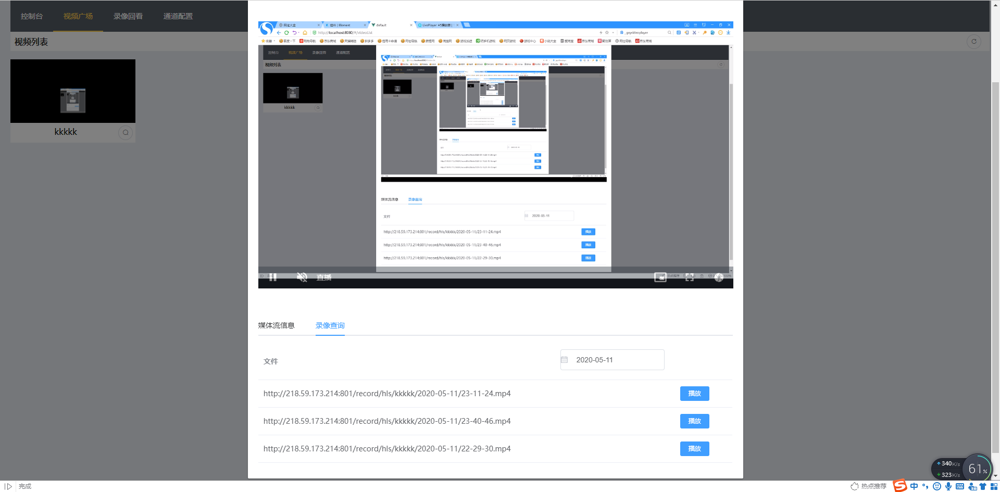

# default

### Where to change
```
./global.js   
	host=your server ip
	secret=your server secret
	baseMediaUrl=your app addr 
```
## 2020-05-11 

	1.新增录像回看功能
	2.解决媒体流关闭不彻底的问题
	3.拉流更改为ws 
	4.本次更新了前段ui框架版本，解决弹窗概率性卡死界面的问题，需要重新执行 npm install
感谢 [@__z2xy__](https://gitee.com/__z2xy__) 的帮助

## 效果展示



## Project setup
```
npm install
```

### Compiles and hot-reloads for development
```
npm run serve
```

### Compiles and minifies for production
```
npm run build
```

### Run your tests
```
npm run test
```

### Lints and fixes files
```
npm run lint
```

### Customize configuration
See [Configuration Reference](https://cli.vuejs.org/config/).
